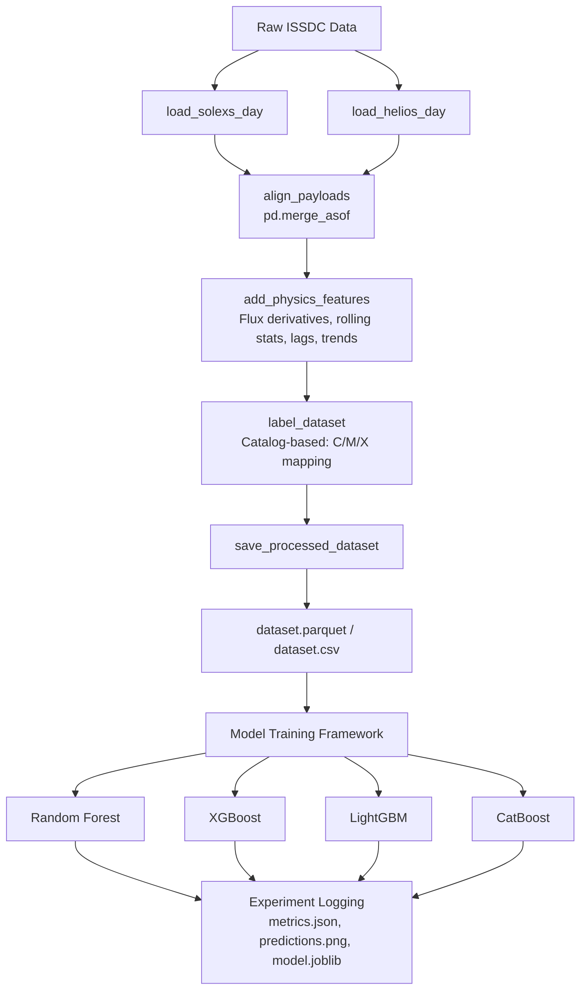

# ✍ About

## 🌌 Scientific Motivation

Solar flares are sudden, intense eruptions of electromagnetic radiation on the Sun, releasing up to $10^{25}$ joules of energy. These events can trigger Coronal Mass Ejections (CMEs), which interact with the Earth's magnetosphere, leading to geomagnetic storms. These space weather disturbances pose severe risks to:
* Satellite communications and GPS navigation
* Electrical power grids on Earth
* Astronauts in space and high-altitude commercial flights

Early prediction (forecasting) and real-time detection (nowcasting) of solar flares are critical to mitigative operations. By utilizing Soft X-ray (SXR) observations from **SoLEXS** and Hard X-ray (HXR) observations from **HEL1OS**, this system leverages the physics of solar atmospheres:
* **SXR** captures thermal plasma heating (ideal for nowcasting and class mapping).
* **HXR** captures non-thermal particle acceleration (vital for early indicators of impulsive flare phases).

---

## 🛰️ Aditya-L1 Payload Description

Aditya-L1 is India's pioneering coronagraphy satellite orbiting at the Sun-Earth Lagrangian Point L1. This system integrates data from:
1. **SoLEXS (Solar Low Energy X-ray Spectrometer):**
   * **Spectral Range:** 1 keV - 22 keV (Soft X-rays).
   * **Measurement:** Thermal plasma emission, flare evolution, class assessment (A/B/C/M/X).
2. **HEL1OS (High Energy L1 Orbiting X-ray Spectrometer):**
   * **Spectral Range:** 10 keV - 150 keV (Hard X-rays).
   * **Measurement:** Impulsive energy release, particle acceleration processes, spectral indices.

---

## 🔄 Data Pipeline Diagram



---

## 🎯 Machine Learning Tasks

To support robust space weather operational requirements, the framework defines three key machine learning prediction tasks:

1. **Task A: Nowcasting / Real-Time Detection (`flare_now`)**
   * **Target:** Predict whether a solar flare event is currently occurring (`1`) or if the Sun is quiet (`0`) at any given second.
   * **Application:** Instantaneous automated space weather alert systems.

2. **Task B: Flare Forecasting (`flare_future`)**
   * **Target:** Predict whether a solar flare onset will occur within a future window (5-minute, 10-minute, or 30-minute horizons). Default standard is the **10-minute horizon**.
   * **Application:** Strategic preparation and mitigation for satellite and communication operators.

3. **Task C: Classification & Magnitude Estimation (`flare_class`)**
   * **Target:** Categorize solar activity into four ordinal classes:
     * `0`: **Quiet** (No flare/background activity)
     * `1`: **C-Class** (Common, minor solar flare)
     * `2`: **M-Class** (Moderate, potentially disruptive flare)
     * `3`: **X-Class** (Extreme, high-energy flare event)
   * **Application:** Predictive assessment of space weather severity and geomagnetic storm risks.

---

## 📂 Repository Structure

```
Flaleon/
├── data/
│   ├── raw/                 # Raw ISSDC data organized by date
│   │   └── 2026-06-21/      # Example: YYYY-MM-DD
│   ├── processed/           # Processed datasets and dataset_info.json
│   └── labels/              # Flare catalogs (e.g., GOES catalog CSVs)
├── src/
│   ├── data/                # Discovering and reading raw FITS files
│   │   └── ingest.py
│   ├── preprocessing/       # Timestamp alignment and dataset builder
│   │   ├── alignment.py
│   │   └── dataset_builder.py
│   ├── features/            # Feature extraction and selection
│   │   ├── engineering.py
│   │   └── selection.py
│   ├── labeling/            # Modular labeling (Catalog / Threshold)
│   │   └── labeler.py
│   ├── training/            # Model training, split, hyperparams
│   │   ├── train.py
│   │   └── run_cross_split_validation.py
│   ├── inference/           # Inference pipeline and deployment code
│   │   └── predict.py
│   └── utils/               # Configurations, metrics, and visualization
│       ├── config.py
│       ├── metrics.py
│       └── visualization.py
├── models/                  # Global models directory
├── outputs/                 # Inference prediction outputs
├── experiments/             # Experiment tracking artifacts
├── notebooks/               # Research and development notebooks
├── docs/                    # Technical documentation
├── run_pipeline.py          # End-to-end automation runner
├── DATA.md                  # Discovered FITS format documentation
└── README.md                # Project landing page
```


