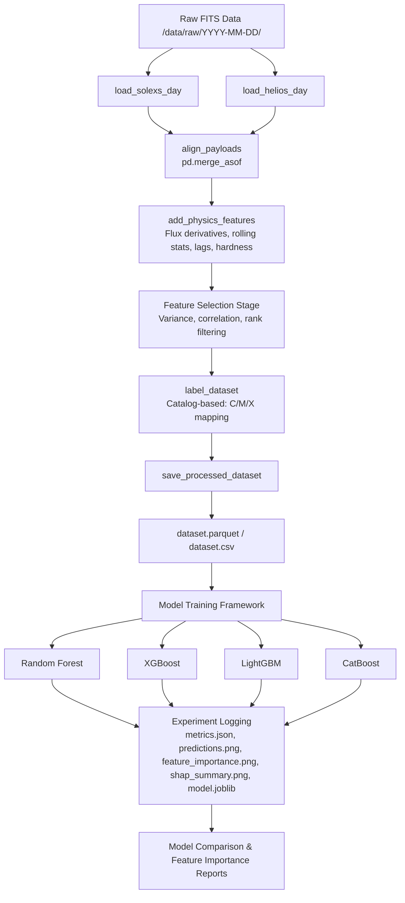

# Aditya-L1 Solar Flare Forecasting System: Current Status & Guide

Welcome to the **Aditya-L1 Solar Flare Forecasting Project (solarflare-ai)**. This document provides a comprehensive overview of the system's architecture, data pipeline, feature engineering, labeling strategies, machine learning models, and diagnostic tools. It serves as a developer guide for understanding, upgrading, and contributing to the project.

---

## 🌌 Project Overview & Scientific Motivation

Solar flares are sudden eruptions of electromagnetic energy in the solar atmosphere. These events release high-energy particles and radiation that can disrupt satellite communications, damage power grids, and present radiation hazards to space missions. 

Predicting these flares involves two primary challenges:
1. **Nowcasting (Detection):** Identifying in real time that an active flare event is underway.
2. **Forecasting (Prediction):** Emitting warning signals before a flare starts (e.g., a 10-minute warning horizon).
3. **Magnitude Prediction (Classification):** Estimating the severity/class (C, M, or X) of the incoming flare.

### Aditya-L1 Payload Integration
This system integrates data from two key payloads onboard India's Aditya-L1 spacecraft:
* **SoLEXS (Solar Low Energy X-ray Spectrometer):** Observes Soft X-rays (SXR) in the **1 keV - 22 keV** range. SXR flux captures thermal plasma heating, which is ideal for nowcasting and assessing final flare magnitude.
* **HEL1OS (High Energy L1 Orbiting X-ray Spectrometer):** Observes Hard X-rays (HXR) in the **10 keV - 150 keV** range. HXR captures non-thermal particle acceleration. Because particle acceleration precedes thermal heating, HXR serves as an essential precursor signal for early flare forecasting.

---

## 🏗️ Repository Architecture

The project is structured modularly to isolate data ingestion, preprocessing, features, modeling, and evaluation:

```
solarflare-ai/
├── data/
│   ├── raw/                 # Raw ISSDC data files sorted by date folder (YYYY-MM-DD)
│   ├── processed/           # Processed datasets (dataset.parquet, dataset.csv, dataset_info.json, selected_features.json)
│   └── labels/              # Auto-generated and reference solar flare catalogs (goes_flares.csv)
├── src/
│   ├── data_ingestion/      # FITS file parser and raw data loaders (ingest.py)
│   ├── preprocessing/       # Time synchronization and alignment (alignment.py, dataset_builder.py)
│   ├── features/            # Physics-based feature extraction (engineering.py, selection.py)
│   ├── labeling/            # Modular labeling for detection and forecasting (labeler.py)
│   ├── training/            # Chronological splitting, Optuna tuning, and training framework (train.py)
│   ├── inference/           # Single-day inference and predictions exporter (predict.py)
│   └── utils/               # Configs, metrics, and visualization (config.py, metrics.py, visualization.py)
├── models/                  # Global models directory storing latest trained estimators and feature importances
├── outputs/                 # Exported inference predictions
├── experiments/             # Experiment tracking folder (sequential runs: experiment_001, comparison report files)
├── audit.py                 # Diagnostic script auditing coverage vs catalog labels
├── audit_results.csv        # Detailed audit reports for observation windows
├── check_counts.py          # Quick audit for SoLEXS data availability and rate range
├── check_helios_counts.py   # Quick audit for HEL1OS CDTe/CZT data availability
├── run_pipeline.py          # End-to-end automation runner (rebuilds data, selects features, and trains models)
└── current.md               # System status and contribution guide (this file)
```

---

## 🔄 The Data Pipeline

The pipeline processes raw data folders through a sequential set of steps to build a training-ready unified dataset.



### 1. Ingestion (`src/data_ingestion/ingest.py`)
* **SoLEXS Loader:** Automatically searches for `.lc.gz` files containing spacecraft time and soft X-ray count rates.
* **HEL1OS Loader:** Searches for `lightcurve_cdte1.fits`, `lightcurve_cdte2.fits`, `lightcurve_czt1.fits`, and `lightcurve_czt2.fits`. If multiple parts exist, they are merged and sorted.
* **Detector Compounding:** To combat noise and dropouts, the loaders average the counts from redundant detectors:
  * `helios_counts` is the mean of CDTe1 and CDTe2.
  * `helios_czt_counts` is the mean of CZT1 and CZT2 (defaulting to 0 if CZT data is missing).

### 2. Temporal Alignment (`src/preprocessing/alignment.py`)
* **Time Scale Conversion:** SoLEXS spacecraft timestamps are aligned to HEL1OS Unix Epoch timestamps (converted from MJD using `astropy.time.Time`).
* **Clock Offset Adjustment:** A physical clock offset of **0.322 seconds** is subtracted from HEL1OS timestamps to synchronize them with SoLEXS.
* **Merge Strategy:** A backward-looking `pd.merge_asof` merges HEL1OS onto SoLEXS timestamps. This maintains the SoLEXS 1-second cadence, uses a strict `nearest` search direction, and applies a `1.0-second` matching tolerance. Unaligned columns are forward/backward filled, with missing ranges padded with `0.0`.

---

## 🧪 Physics-Based Feature Engineering (`src/features/engineering.py`)

To provide classifiers with temporal context and physical metrics without using lookahead (future) data, the system computes several columns:

1. **Flux Derivatives & Acceleration ($dFlux/dt$ and $d^2Flux/dt^2$):**
   * First and second derivatives of count rates for SoLEXS, HEL1OS CDTe, and HEL1OS CZT.
   * Rolling acceleration (rolling mean of $dFlux/dt$ over 30s and 60s windows).
2. **Spectral Hardness Features:**
   * **Hardness Ratios:** CDTe/SoLEXS, CZT/SoLEXS, and CZT/CDTe ratios.
   * **Hardness Rate of Change:** First derivative of the hardness ratios ($d(HR)/dt$) to track spectral hardening.
   * **Hardness Spectral stats:** Rolling mean, standard deviation, and slope over a 60s window.
3. **Advanced Rolling Statistics (30s, 60s, and 300s windows):**
   * Rolling mean, standard deviation, median, minimum, maximum, rolling range ($max - min$), rolling Root Mean Square (RMS), rolling variance, and rolling coefficient of variation ($std / mean$).
   * Moving average ratio ($\frac{\text{Current Counts}}{\text{Rolling Mean}}$) and local peak prominence ($\text{Current Counts} - \text{Minimum in window}$).
   * Rolling slopes ($\frac{x_t - x_{t-w}}{w}$) for 30s and 60s windows.
4. **Higher-Order Temporal Features:**
   * Exponential Moving Averages (EMAs) for 10s, 30s, 60s, and 300s spans.
   * EMA differences (e.g. $EMA_{10s} - EMA_{60s}$, $EMA_{60s} - EMA_{300s}$).
5. **Statistical Descriptors (60s and 300s windows):**
   * Rolling Skewness and Rolling Kurtosis.
   * Local Z-Score ($\frac{x - mean}{std + \epsilon}$) and Local Anomaly Score (absolute Z-score).
6. **Peak Behavior:**
   * Distance from local maximum and distance from rolling minimum (measured in seconds/steps since peak/trough).
   * Rise ratio ($\frac{x - min}{range + \epsilon}$) and decay ratio ($\frac{max - x}{range + \epsilon}$).
7. **Cross-Instrument Relationships:**
   * Rolling correlation and rolling covariance between SoLEXS and HEL1OS CDTe over a 300s window.
   * Normalized flux ratio ($\frac{solexs - helios}{solexs + helios + \epsilon}$).
   * CDTe/CZT agreement index ($\frac{cdte - czt}{cdte + czt + \epsilon}$) and rolling CDTe-CZT correlation.
8. **Time Context:**
   * Elapsed observation fraction ($\frac{t - t_{start}}{t_{end} - t_{start}}$) and seconds since observation start.

---

## ✂️ Automatic Feature Selection (`src/features/selection.py`)

To optimize model training, a modular feature selection stage is integrated:
* **Duplicate Filter:** Automatically scans and drops features with identical values.
* **Constant & Near-Constant Filter:** Drops features with a variance lower than `1e-4` (near-constant).
* **Correlation Filter:** Finds pairs of highly correlated features ($>0.95$) and drops the one that has a lower absolute correlation with the target.
* **Feature Rank Aggregator:** Computes normalized feature importance rankings using:
  1. Random Forest importance
  2. XGBoost importance
  3. LightGBM importance
  4. CatBoost importance
  5. Permutation importance (subsampled to 5000 rows for speed)
  6. Mutual Information score (subsampled to 5000 rows for speed)
* **Output:** Saves the top 30 ranked features to `selected_features.json` in the processed data directory, and logs a comprehensive report to `feature_selection_report.txt`.

---

## 🏷️ Flare Labeling System & Auditing

A major challenge in solar flare modeling is managing data gaps caused by night-side passes or satellite orbits, which can lead to misclassifying solar flare activity as "Quiet". The system implements a robust labeling and auditing strategy to handle this.

### 1. Automated Event Catalog Builder (`src/labeling/labeler.py`)
If a pre-compiled flare catalog is not found, the pipeline automatically generates one (`data/labels/goes_flares.csv`) by scanning SoLEXS count rates:
* Applies a 10s rolling mean to smooth photon noise.
* Identifies regions exceeding a threshold of **1,000 counts/sec**.
* Groups contiguous active windows within **5 minutes (300 seconds)** of each other.
* Automatically labels the flare class based on the peak counts:
  * **X-class:** Peak counts $> 15,000$ counts/sec
  * **M-class:** Peak counts $> 5,000$ counts/sec
  * **C-class:** Peak counts $> 1,000$ counts/sec
  * **B-class (Fallback):** Peak counts $\le 1,000$ counts/sec

### 2. Daily Strongest Labeling Strategy
* **The Problem:** The satellite observation window is often partial. If a strong flare occurred during the day but outside of the active window, models learn noisy labels.
* **The Solution:** Set `LABELING_STRATEGY = 'daily_strongest'` in `src/utils/config.py`. Under this strategy, the system identifies all cataloged flares peaking within the active window. The entire day's sequence is then labeled using the class of the **strongest flare** in that window.

### 3. Diagnostic Auditing (`audit.py`)
`audit.py` maps the exact boundary times (`obs_start`, `obs_end`) of each raw folder. It checks which cataloged flares occurred on that calendar day versus which ones actually occurred during the active observation window and outputs a summary table (`audit_results.csv`).

---

## 🤖 Machine Learning Framework (`src/training/train.py`)

The ML pipeline is set up to train estimators for three separate tasks using tabular frameworks:
* **Task A: Flare Detection (Nowcasting):** Target is `flare_now` (binary).
* **Task B: Flare Forecasting (10-Min warning):** Target is `flare_future_10min` (binary).
* **Task C: Flare Magnitude Classification:** Target is `flare_class` (multiclass: Quiet: 0, C: 1, M: 2, X: 3).

### Model Baselines
1. **Random Forest Classifier**
2. **XGBoost Classifier**
3. **LightGBM Classifier**
4. **CatBoost Classifier**

### Training Enhancements (Balancing)
* **Class Weights & Balanced Sampling:** Enabled via `USE_CLASS_WEIGHTS` and `USE_BALANCED_SAMPLING` flags. The framework automatically computes sample weights based on inverse class frequencies (`compute_sample_weight`) and feeds them to the `.fit()` method of RF, XGBoost, LightGBM, and CatBoost models.

### Chronological Data Splitting
To prevent temporal data leakage (where the model learns future patterns to predict past events), the training engine executes a **time-based split** rather than a random shuffle:
* **Train:** First 70% of the timeline.
* **Validation:** Next 15% of the timeline.
* **Test:** Final 15% of the timeline.

### Optional Hyperparameter Search
Optional Optuna-based hyperparameter optimization is available inside `train.py`. It searches for optimal parameters (estimators, depth, learning rates, leaves) using the chronological validation set. It is disabled by default and can be enabled through the `USE_OPTUNA` config flag.

### Evaluation Metrics (`src/utils/metrics.py`)
In addition to accuracy, precision, recall, and F1, the framework tracks:
* **Balanced Accuracy**
* **Matthews Correlation Coefficient (MCC)**
* **Cohen's Kappa**
* **Brier Score** (for probability calibration)
* **PR-AUC (Precision-Recall Area Under the Curve)**
* **Multi-class ROC-AUC** (macro-averaged over classes)
* **Stratified Recall & Precision** (computed per class)
* **Warning Lead Time (seconds):** Specifically for forecasting, calculating the time difference between the emission of a True Positive warning and actual flare onset in the catalog.

---

## 📊 Reports & Logs

Every execution of `run_pipeline.py` saves sequential folders under `experiments/experiment_XXX/`:
* `model.joblib`: The serialized model.
* `metadata.json`: Feature list, timestamp, row counts, parameters.
* `metrics.json`: Evaluated metrics, training/inference latencies, memory footprint, and model file sizes.
* `predictions.png`: Visual plot overlaying true vs. predicted labels.
* `feature_importance.csv` and `feature_importance.png`: Feature weight ranking (Top 20).
* `shap_summary.png`: Beeswarm summary plot computed on test set samples using SHAP.

### Automated Comparisons (Cross-Model Reports)
At the end of a training run, the pipeline automatically compiles:
1. **`model_comparison_<task>.md` & `.csv`:** A tabular comparison of Accuracy, Precision, Recall, Macro F1, Balanced Accuracy, ROC-AUC, Training Time, Inference Time, Model Size, Memory Usage, and Feature Count across RandomForest, XGBoost, LightGBM, and CatBoost.
2. **`feature_importance_comparison_<task>.csv` & `.png`:** Grouped feature importance values side-by-side across all four model types for the Top-20 features.

---

## 🛠️ Operational Guide: How to Add Data and Run Tasks

### 1. How to Expand the Dataset
The pipeline is designed to dynamically discover and ingest any new observation days without code modifications. To add a new day:
1. Create a new directory in `data/raw/` named in `YYYY-MM-DD` format (e.g., `data/raw/2026-07-01`).
2. Inside that directory, place:
   * **SoLEXS Data:** A subfolder containing the `.lc.gz` lightcurve file.
   * **HEL1OS Data:** A subfolder containing `lightcurve_cdte1.fits` and/or `lightcurve_cdte2.fits` (optionally including `lightcurve_czt1.fits` and `lightcurve_czt2.fits`).

### 2. How to Re-Run the End-to-End Pipeline
To clear the processed data cache, rebuild the flare event catalog, merge the timeseries data, and retrain the models, run:
```bash
# Clear the cache to force a rebuild
rm -f data/labels/goes_flares.csv data/processed/dataset*

# Run the end-to-end pipeline
python3 run_pipeline.py
```

### 3. How to Run Single-Day Inference (`src/inference/predict.py`)
To run inference on a specific day folder using a trained model, execute:
```python
from src.inference.predict import predict_on_day

predict_on_day(
    date_str="2026-06-21", 
    model_path="models/detection_random_forest_latest.joblib",
    task="detection"
)
# Predictions are exported directly to outputs/predictions_detection_20260621.csv
```

### 4. Running Diagnostic Scripts
* **Audit Labels:** Run `python3 audit.py` to evaluate alignment windows and output `audit_results.csv`.
* **SoLEXS Quality Check:** Run `python3 check_counts.py` to print a terminal report of rows, max, min, and mean counts.
* **HEL1OS Quality Check:** Run `python3 check_helios_counts.py` to verify the peak counts for all four HEL1OS detectors (CDTe1, CDTe2, CZT1, CZT2).

---

## 🚀 Future Development Roadmap

1. **Deep Learning Integration:** 
   Transition from tabular classifiers to temporal models (LSTMs, GRUs, or 1D-CNNs) and sequence-to-sequence transformers to better model the flare evolution profile.
2. **Spectral Fitting:**
   Integrate the `.pi.gz` (SoLEXS) and `hel1os_cdte_spectra` (HEL1OS) files to dynamically compute the physical plasma temperature ($T$) and emission measure ($EM$) as input features.
3. **Multi-Instrument Ensembles:**
   Incorporate other payloads on Aditya-L1, such as **SUIT** (Solar Ultraviolet Imaging Telescope) for spatial imaging, and **ASPEX/PAPA** for solar wind particle fluxes.
4. **Active Region Magnetograms:**
   Incorporate magnetic field data (e.g., active region magnetograms from SDO/HMI or line-of-sight magnetograms) to include spatial and magnetic topology features.
